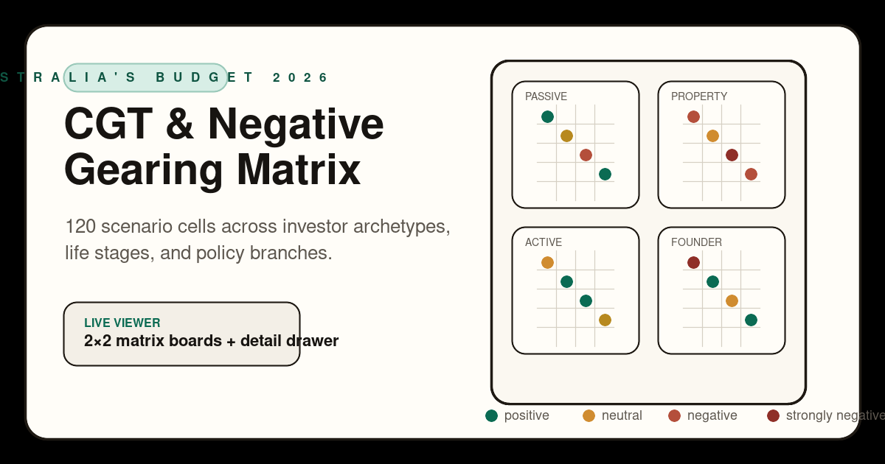

# Budget 2026 CGT & Negative Gearing Matrix



Decision-support matrix for Australia's Budget 2026 capital gains tax and negative gearing changes.

Live deployment:
- https://budget-2026-cgt-negative-gearing-matrix.pages.dev/

Source repository:
- https://github.com/suryast/budget-2026-matrix

This repo is a standalone extraction of the matrix work that was briefly incubated inside `factual-au`. It is now separated so the matrix can evolve as its own product and data package.

## Scope

- CGT and negative gearing scenario planning
- Structured matrix data for investor archetypes, life stages, and policy branches
- Generator-backed JSON artifact
- Static browser UI with 2×2 matrix boards and detail drawer
- Public share metadata and social card asset

## Layout

- [data/SPEC.md](data/SPEC.md): source spec
- [data/schema.json](data/schema.json): JSON schema for the matrix payload
- [data/matrix.json](data/matrix.json): generated matrix output
- [data/generate_matrix.py](data/generate_matrix.py): local generator
- [data/archetypes/](data/archetypes/): archetype briefs
- [data/scenarios/](data/scenarios/): policy scenario briefs
- [data/life_stages/](data/life_stages/): life-stage definitions
- [data/cohorts/](data/cohorts/): voter cohort taxonomy

## Generate

```bash
cd data
python3 generate_matrix.py
```

## Current status

The repo now includes:

- the generated matrix dataset
- the standalone static viewer
- the OG social share asset
- the corrected post-Budget-night negative-gearing grace-window logic

It remains versioned separately from `factual-au`, but links back to the broader methodology and calculator ecosystem from the deployed UI.
